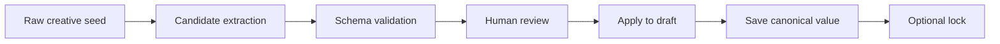

# Case Study: Creative Text Annotation

## Problem

Creative writing input is often short, emotional, incomplete, or ambiguous. A user might write:

> A created life asks its creator to take responsibility.

This sentence is useful, but it is not yet structured data. An AI system or reviewer still needs to know whether it expresses a premise, a conflict, a theme, a character relationship, or a plot event.

The annotation challenge is to preserve creative ambiguity while still making the data usable for review, suggestion, and downstream tools.

## Goal

Design a small annotation workflow that converts free-form creative input into structured candidates with:

- a target label,
- a confidence level,
- supporting evidence,
- provenance,
- human review status,
- and a clear apply / reject / lock lifecycle.

## Reduced Taxonomy

This public case study uses only three sample subelements.

| ID | Meaning | Output Shape |
| --- | --- | --- |
| `concept.core_premise` | The smallest condition that makes the story possible. | Single statement |
| `concept.narrative_question` | The question or tension the story keeps returning to. | One or more questions |
| `concept.logline` | A compact pitch-like summary of protagonist, pressure, and direction. | Single statement |

The private project uses a broader taxonomy. It is intentionally not included here.

## Candidate Lifecycle



Important principle:

> AI output is a candidate, not the canonical value.

The human reviewer or user decides whether a candidate should be applied, edited, rejected, or locked.

## Example

Raw input:

> A created life asks its creator to take responsibility.

Candidate:

```json
{
  "factorId": "concept",
  "subelementId": "concept.core_premise",
  "candidate": "A created life can force its creator to face the moral cost of creation.",
  "evidence": [
    {
      "source": "user_seed",
      "quote": "A created life asks its creator to take responsibility."
    }
  ],
  "reviewState": "needs_human_review"
}
```

Reviewer decision:

- Apply if the candidate preserves the user's actual idea.
- Edit if the candidate is close but too broad or too generic.
- Reject if it invents plot, character, ending, or world rules not present in the input.
- Lock if the value should not be overwritten by later AI suggestions.

## My Role

This case study demonstrates skills in:

- taxonomy design,
- label boundary definition,
- evidence-based annotation,
- candidate JSON normalization,
- human-in-the-loop review design,
- AI output quality control,
- and product thinking for AI-assisted tools.
