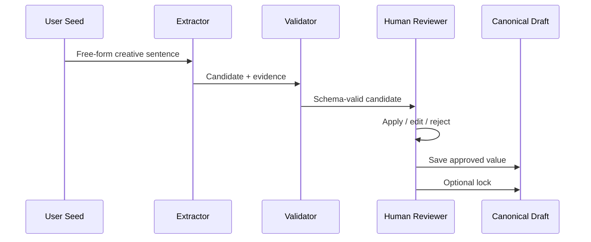

# Demo Flow

This demo uses a fictional, reduced example. It is not a production workflow.

## Input

```text
A created life asks its creator to take responsibility.
```

## Step 1: Candidate Extraction

The text is treated as a raw creative seed. The system proposes possible structured candidates.

```json
{
  "subelementId": "concept.core_premise",
  "candidate": "A created life can force its creator to face the moral cost of creation.",
  "reviewState": "needs_human_review"
}
```

## Step 2: Evidence Check

The candidate must point back to the source.

```json
{
  "source": "user_seed",
  "quote": "A created life asks its creator to take responsibility."
}
```

## Step 3: Human Review

The reviewer asks:

- Is the candidate faithful to the source?
- Did it invent a plot event?
- Is it specific enough to guide later work?
- Does it need editing before being saved?

## Step 4: Apply or Edit

Possible reviewer action:

```json
{
  "action": "edit",
  "editedCandidate": "A neglected creation forces its creator to face the responsibility and cost of giving life."
}
```

## Step 5: Lock

If the value becomes a core reference, it can be locked.

```json
{
  "reviewState": "locked",
  "meaning": "Future AI suggestions should not overwrite this value automatically."
}
```

## Flow Diagram


